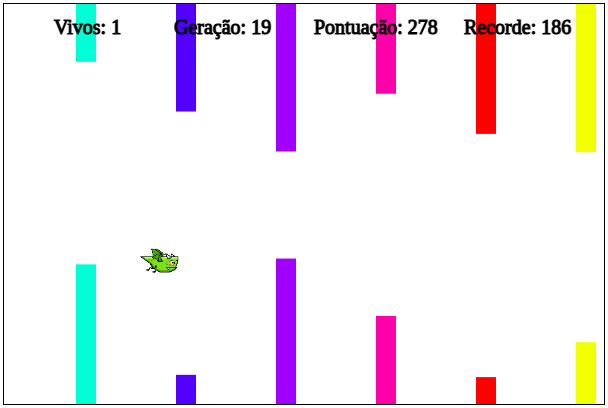
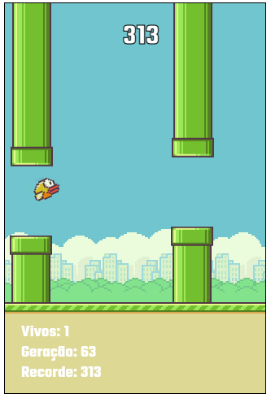

# Machine Learning no Flappy Bird

## Introdução
Neste projeto, vamos desenvolver uma inteligência artificial (IA) que ensina um pássaro a voar entre os obstáculos no jogo Flappy Bird. Utilizaremos Redes Neurais e Algoritmos Genéticos para atingir esse objetivo.

## Rede Neural
Para entender como a IA funciona, primeiro precisamos pensar em como nós, humanos, jogamos Flappy Bird. Para jogar, processamos duas informações essenciais: a altura do pássaro e a altura do espaço entre os tubos (gap). Ajustamos a altura do pássaro para passar pelo gap. Nossa rede neural fará o mesmo: ela usará essas informações e aprenderá, sozinha, a jogar.

### Entradas da Rede Neural
- **Altura do pássaro**: A posição vertical do pássaro na tela.
- **Altura do gap**: A posição vertical do espaço entre os tubos.

### Saídas da Rede Neural
Com essas entradas, a rede neural processa e retorna um valor entre 0 e 1:
- **Saída > 0.50**: O pássaro voa (salta).
- **Saída ≤ 0.50**: O pássaro não voa (cai).

## Algoritmo Genético
Cada geração consiste em 250 redes neurais (chamadas de genomas). 

### Processo de Treinamento:
1. **Teste dos Genomas**: Cada genoma é testado no jogo. As entradas do jogo são mapeadas para as entradas da rede neural, que processa e determina se o pássaro deve voar ou não.
2. **Avaliação de Aptidão**: A aptidão de cada genoma é medida pela quantidade de obstáculos que o pássaro consegue ultrapassar.
3. **Seleção e Mutação**: Após todos os genomas de uma geração serem testados, os dois melhores são selecionados. Em seguida, aplicamos mutações nas redes neurais para criar novos genomas.
4. **Cruzamento e Nova Geração**: Cruzamos e mutamos os genomas selecionados até termos 250 novos genomas. O processo se repete até que uma rede neural seja capaz de jogar eficientemente.

## Informações Importantes
O treinamento da IA pode demorar um pouco e, às vezes, parecer que não está evoluindo. No entanto, com paciência e ao longo de várias gerações, a evolução será visível. Em testes, menos de 50 gerações foram necessárias para que a rede neural aprendesse a jogar bem.

### Exemplos Visuais
Veja a evolução da IA nas imagens abaixo:

#### Versão 1.0

#### Versão 2.0

